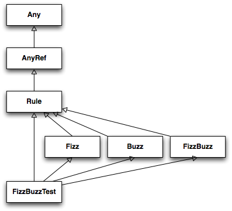

## funksjoner
```scala
val length:String => Int =
  in => in.length

def takesAFun(f: String => Int) = {
  val word = "Hello World"
  f(word)
}

takesAFun(length)

takesAFun(in => in.length)

takesAFun(_.length)
```

---

## metoder ~= funksjoner
```scala
def length(in: String) = in.length

takesAFun(length)
```

---

```scala
val noArg: () => Int =
  () => 10

def takesNoArg(f: () => Int) = {
  val anInt = f()
  5 + anInt
}

takesNoArg(noArg)

takesNoArg(() => 10)
```

---

## call-by-name
```scala
def callByName(f: => Int) = {
  val anInt = f
  5 + anInt
}

callByName(5)

def callByNameIgnore(f: => Int){
  5 + 10
}

callByNameIgnore(throw new Exception("who cares?"))
// ingen exception kastet
```

---

## parameter-set
```scala
def multiple(name: String)(age: Int) {
  println(name + " is " + age + " years old")
}

multiple("Mr Java")(99)

multiple("Mr Scala"){
  5 + 10
}
```

---

```scala
def debug(name: String)(expr: => String){
  val logger = Logger.getLogger(name)
  if(logger.isDebugEnabled){
    logger.debug(expr)	
  }
}

debug("database"){
  DB.reallyHeavyOperation.mkString(",")
}
```

---

## partial application
```scala
def printIt(name: String) = println("Look, its " + name)

val partiallyApplied: String => Unit = printIt _

partiallyApplied("pretty cool")
// Look, its pretty cool
```

---

```scala
val later = new ListBuffer[() => Unit]

def register(f: => Unit){
  later += f _
}

register(println("Hello"))
register(println("World"))
register(throw new Exception("Oh noes"))

println("Go!")
later.foreach(f => f())
/*
Go!
Hello
World
java.lang.Exception: Oh noes
  at ....
*/
```

---

## traits
```scala
trait Mult {
  def mult(a: Int, b: Int) = a * b
}

trait Add {
  def add(a: Int, b: Int) = a + b
}

object Calc extends Mult with Add

Calc.mult(4, Calc.add(1, 2))
```

---

## stackable modifications ##
```scala
trait Rule {
  def convert(int: Int) = int.toString
}

trait Fizz extends Rule {
  override def convert(int: Int) =
    if(int % 3 == 0) "Fizz" else super.convert(int)
}

trait Buzz extends Rule {
  override def convert(int: Int) =
    if(int % 5 == 0) "Buzz" else super.convert(int)
}

trait FizzBuzz extends Rule {
  override def convert(int: Int) =
    if(int % 3 == 0 && int % 5 == 0) "FizzBuzz"
    else super.convert(int)
}
```

---



---

```scala
object FizzTest extends Rule with Fizz
(0 to 15).foreach(FizzTest.convert)

object BuzzTest extends Rule with Buzz
(0 to 15).foreach(BuzzTest.convert)

object FizzBuzzTest extends Rule with Fizz with Buzz with FizzBuzz
(0 to 15).foreach(FizzBuzzTest.convert)

object BuzzFizzTest extends Rule with FizzBuzz with Fizz with Buzz
(0 to 15).foreach(BuzzFizzTest.convert)
```

---

## pattern matching & case classes
```scala
sealed trait Tree
case class Branch(left: Tree, right: Tree) extends Tree
case class Leaf(value: Int) extends Tree

def sum(tree:Tree): Int = tree match {
  case Branch(left, right) => sum(left) + sum(right)
  case Leaf(value) => value
}

val tree = Branch(
    Branch(Leaf(1), Leaf(2)),
    Branch(Leaf(3), Leaf(4)))

sum(tree)
```

---

## pattern matching og exceptions
```scala
case class SomeException(why: String) extends Exception(why)

try{
  somethingThatCanThrowAnException()
} catch {
  case SomeException(why) => println("Thats why: " + why)
  case ex:Exception => ex.printStackTrace
}
```

---


---

a.k.a 'Enrich my Library'

---

## adapter pattern
```scala
class PlusMinus(i: Int){
  def +- (o: Int) = i-o to o+i
}

new PlusMinus(5) +- 2
//Range(3, 4, 5, 6, 7)
```

---

## implicit conversions
```scala
implicit class PlusMinus(i: Int){
  def +- (o:Int) = i-o to o+i
}

5 +- 2
//Range(3, 4, 5, 6, 7)
```

---

```scala
class PlusMinus(i: Int){
  def +- (o: Int) = i-o to o+i
}

implicit def plusMinus(i: Int) = new PlusMinus(int)

5 +- 2
//Range(3, 4, 5, 6, 7)
```

---

## Oppgavetid :-)

Skriv ditt eget testrammeverk!

[https://github.com/arktekk/scala-kurs-oppgaver/tree/master/testframework](https://github.com/arktekk/scala-kurs-oppgaver/tree/master/testframework)
